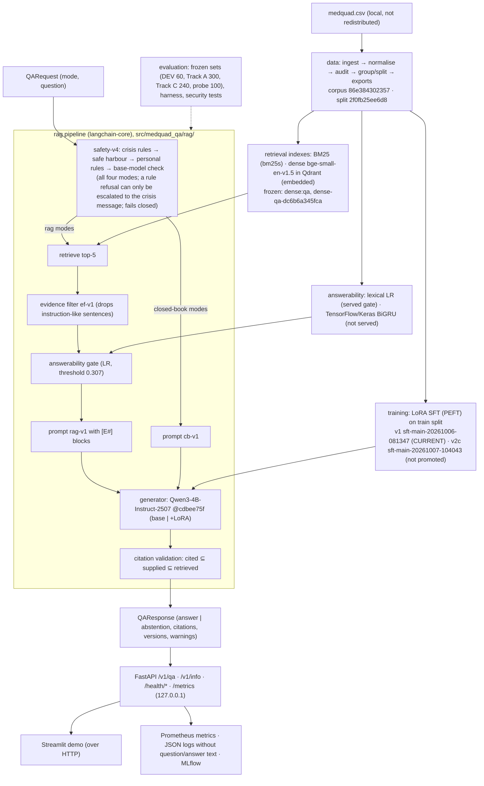

# Architecture

Owner: lead. Status as of D-066 (2026-10-08). This diagram shows the code as frozen for the remediation retest (`a6b7d3e`, D-064). Interfaces are defined in [`docs/architecture/contracts.md`](../architecture/contracts.md); the adapter boundaries are in [`docs/architecture/overview.md`](../architecture/overview.md).



Plain-text version, for viewers that do not render Mermaid:

```
medquad.csv ─► data (manifests: corpus_version, split_version)
   ├─► retrieval indexes (BM25, dense/Qdrant embedded; index manifests)
   ├─► LoRA SFT (v1 = CURRENT; v2c not promoted)
   └─► answerability classifiers (LR served; Keras BiGRU not served)

QARequest ─► safety-v4 (rules → base-model check; all modes; fail-closed)
   rag modes:         retrieve → evidence filter ef-v1 → answerability gate → rag-v1 prompt
   closed-book modes: cb-v1 prompt
   ─► Qwen3-4B (base | +LoRA) ─► citation validation ─► QAResponse
QAResponse ─► FastAPI (127.0.0.1) ─► Streamlit · Prometheus · JSON logs · MLflow
```

## safety-v4 decision order

As implemented in `check_question` (`src/medquad_qa/rag/safety.py:631`), first match wins:

1. **Crisis rules.** A match returns the crisis message (`rule_id "emergency"`), with no model call.
2. **Safe harbour.** An informational question with no personal or specific-person narrative is answered, with no model call.
3. **Personal-advice rules.** A match stays refused. The model check still runs, but it can only escalate the refusal to the crisis message, never release it as an answer.
4. **Base-model check** for everything else: CRISIS → crisis message, PERSONAL → refusal (`model_personal`), GENERAL → answer.

Any check failure (error, timeout, unparsable output) refuses with the crisis message and the `safety_check_failed` warning. Without a checker (offline tests), steps 1–3 run as rules only. D-062 lists these stages as properties rather than in execution order; the order above is the code's.

## What each version identifier means

| Identifier | Frozen value (D-064) | Recorded in |
|---|---|---|
| `corpus_version` | `medquad-1.0.0-86e384302357` | `data/manifests/corpus_manifest.json` |
| `split_version` | `split-20261006-2f0fb25ee6d8` | `data/manifests/split_manifest.meta.json` |
| `index_version` | `dense-qa-dc6b6a345fca` | `artifacts/indexes/manifests/` |
| `model_version` | `Qwen/Qwen3-4B-Instruct-2507@cdbee75f…` (+`lora:<run_id>`) | `versions()`, run meta |
| `prompt_version` | `rag-v1+df593554` (RAG), `cb-v1+a1f08aaf` (closed-book) | `src/medquad_qa/rag/prompts.py` |
| `safety_rules_version` | `safety-v4+9be5f4d1` (check `check-v1+fcac1ca3`) | `src/medquad_qa/rag/safety.py` |
| `evidence_filter_version` | `ef-v1+e899826d` | `src/medquad_qa/rag/evidence_filter.py` |
| answerability threshold | `answerability-lexlr@3defcd00a31f:maxf1-val:0.307172` | `docs/models/answerability_card.md` |

## Deployment boundary

The Docker Compose stack (`deploy/compose.yaml`) binds to 127.0.0.1 and runs as non-root (S4). It was smoke-tested with the pre-fix images (S6). No image contains the frozen remediation code, and demo, deployment and user-facing serving are blocked (D-052, D-066).
